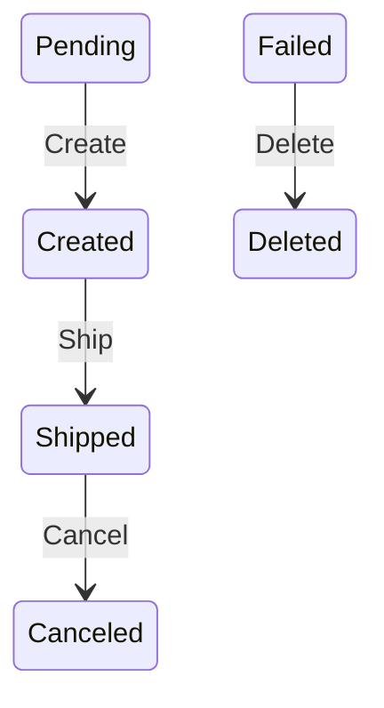

# FlowLite

[](https://www.nuget.org/packages/FlowLite.Abstractions/)
[](https://www.nuget.org/packages/FlowLite/)
[](https://www.nuget.org/packages/FlowLite.Diag/)
[](https://www.nuget.org/packages/FlowLite.Testing/)
[](https://www.nuget.org/packages/FlowLite.Diagnostics/)
[](https://github.com/HawkN113/FlowLite/blob/main/LICENSE)

|  | **FlowLite** is a high-performance, thread-safe, and developer-friendly finite state machine (FSM) library for .NET. It helps you manage entity state transitions, workflow automation, and domain-driven state logic in a structured and testable way. Features: fluent API for state and trigger configuration, async support for transition logic, export as Mermaid.js or DOT graph, built-in JSON and in-memory storage. |
|--------------------------------------|--------------------------------------------------------------------------------------------------------------------------------------------------------------------------------------------------------------------------------------------------------------------------------------------------------------------------------------------------------------------------------------------------------------------------------------------------------------------------------------------------------------------------------------------------------------------------------------------------------------------------------------------------------------------|
---

## Features ([docs](docs/flowlite.md))
- **Lightweight & Fast** – Optimized for high-performance applications.
- **Asynchronous & Thread-Safe** – Ensures smooth execution in concurrent environments.
- **Declarative API** – Define state transitions with a clean and fluent syntax.
- **State Persistence** – Supports **JSON-based storage**, **in-memory storage**.
- **Event Hooks** – Capture and log every state change for debugging and auditing (check state, check entry, delete entry).
- **Cycle Prevention** – Detects and prevents cyclic transitions.
- **Error Handling** – Graceful fallback mechanisms for invalid transitions.
- **Final States** – Define terminal states where transitions are restricted.
- **Flexible Configuration** – Supports **builder pattern** for easy transition setup.
- **Parallel & Sequential State Execution** – Suitable for multi-threaded workflows.
- **Custom Transition Conditions** – Add business logic to control transitions.
- **Dependency Injection Support** – Seamless integration into DI containers.
- **Storage-Agnostic** – Plug in your own storage strategy.
- **Diagram Export** – Export transitions as **Mermaid.js** or **Graphviz DOT**.

## Advanced features
For `FlowLite.Diag` ([docs](docs/flowlite.diag.md)):

- Scans `.cs` files and locates all `FlowTransitionBuilder<...>` instances.
- Generates Mermaid.js or Graphviz DOT diagrams from C# code.
- Automatically separates transitions by builder instance.
- Displays file path and per-builder FSM diagrams in the output.

For `FlowLite.Testing` ([docs](docs/flowlite.testing.md)):

- **Fluent Assertions** — expressive `.Should().Allow(...)`, `.BeIn(...)`, `.Logs()`, etc.
- **Trigger Validation** — `.Assert().Allow(...)` or `.NotAllow(...)`.
- **Entity Validation** — validate entity changes or deletions via `.HaveEntity(...)` and `.DeleteEntity()`.
- **Log Inspection** — assert warnings, errors, or specific messages.
- **History Validation** — verify transition path, length, or contents.
- **Minimal & Fast** — no dependencies on other testing libraries or frameworks.

For `FlowLite.Diagnostics` ([docs](docs/flowlite.diagnostics.md)):
- **Console logging** of all FSM events.
- **Telemetry metrics via System.Diagnostics.Metrics** (OpenTelemetry-compatible).
- **DiagnosticListener events** (StateChanged, EntityChanged, EntityDeleted).
- **Integration with ILogger** (Microsoft.Extensions.Logging).
- **Global diagnostics**: auto-attach listeners to all FSMs via FlowLite global hook.
- Extensibility via custom **IDiagnosticsFlowLiteListener**.

---
## Additional tools and features

- **[FlowLite.Diag](https://www.nuget.org/packages/FlowLite.Diag/)** is a cross-platform .NET CLI tool for **visualizing finite state machine (FSM)** state transitions based on `FlowTransitionBuilder` code from the `FlowLite` library.
- **[FlowLite.Testing](https://www.nuget.org/packages/FlowLite.Testing/)** is a minimalistic and fluent testing library designed for writing expressive and structured unit tests for your `FlowLite` workflows.
- **[FlowLite.Diagnostics](https://www.nuget.org/packages/FlowLite.Diagnostics/)** is an extension for `FlowLite` that adds logging, telemetry, observability, and global FSM diagnostics. It allows you to monitor the full lifecycle of your finite state machine, including transitions, errors, entity changes, and deletions.
---

## Getting Started

### When to Use FlowLite?
- **Order Processing Systems** – Manage payment, shipping, and delivery statuses.  
- **Workflow Automation** – Control document approval, user onboarding, or task execution.  
- **Game Development** – Manage player states, AI behavior, and event triggers.  
- **IoT Device State Tracking** – Handle device power states, connectivity, and error handling.  
- **Business Processes** – Automate transitions in **CRM, ERP, BPM** applications.

### When to Use FlowLite.Diag?
- Designing workflows and business processes using [FlowLite](https://www.nuget.org/packages/FlowLite/)
- Auto-generating documentation from source.
- Visual debugging of state transitions.

### When to Use FlowLite.Testing?
- To write unit tests for your FlowLite-based FSMs.
- To verify that a specific trigger is allowed or disallowed.
- To check logs, such as errors, warnings, or final state messages.
- To assert transition history, including order and contents.
- To validate that an entity was updated or deleted during a transition.
- Building test-driven FSM logic with clear, maintainable assertions.
- To test FSM behavior independently of storage or infrastructure.

### When to Use FlowLite.Diagnostics?
- Track state transitions, entity changes, and lifecycle events using logs, metrics, and diagnostic events.
- Gain insights into FSM internals when developing complex transition logic. Easily catch unexpected transitions or silent errors.
- Detect and analyze transition failures, entity deletions, and state rollbacks using structured logs or metrics.
- Collect metrics with OpenTelemetry or System.Diagnostics.Metrics to monitor FSM health, latency, and usage patterns.
- Enable DiagnosticListener integration to inspect FSM activity in debuggers, profilers, or telemetry dashboards.
- Log all state and entity changes for compliance or historical tracking purposes (e.g., in financial systems or healthcare).
- Automatically attach FSM listeners to track performance and detect abnormal behavior in live systems.

---

## Installation

To add the Nuget package for the project type.

| Package                                                                      | Description                                                                                                                                                                                                                                                                                                                                                                                                   |
|------------------------------------------------------------------------------|---------------------------------------------------------------------------------------------------------------------------------------------------------------------------------------------------------------------------------------------------------------------------------------------------------------------------------------------------------------------------------------------------------------|
| [FlowLite](https://www.nuget.org/packages/FlowLite)                          | A high-performance, thread-safe, and developer-friendly finite state machine (FSM) library for .NET. It helps you manage entity state transitions, workflow automation, and domain-driven state logic in a structured and testable way. Features: fluent API for state and trigger configuration, async support for transition logic, export as Mermaid.js or DOT graph, built-in JSON and in-memory storage. |
| [FlowLite.Diag](https://www.nuget.org/packages/FlowLite.Diag)                | A cross-platform .NET CLI tool for **visualizing finite state machine (FSM)** state transitions based on `FlowTransitionBuilder` code from the [`FlowLite`](https://github.com/HawkN113/FlowLite) library.|
| [FlowLite.Testing](https://www.nuget.org/packages/FlowLite.Testing)          | A minimalistic and fluent testing library designed for writing expressive and structured unit tests for your **FlowLite FSM** workflows.|
| [FlowLite.Diagnostics](https://www.nuget.org/packages/FlowLite.Diagnostics/) | An extension for **FlowLite** that adds logging, telemetry, observability, and global FSM diagnostics. It allows you to monitor the full lifecycle of your finite state machine, including transitions, errors, entity changes, and deletions.|

To install the latest version of the [FlowLite](https://www.nuget.org/packages/FlowLite/):

### FlowLite
### NuGet Package Manager
```bash
Install-Package FlowLite -Version 8.0.0
```
### .NET CLI
```bash
dotnet add package FlowLite.Abstractions --version 8.0.0
dotnet add package FlowLite --version 8.0.0
```

### FlowLite.Diag
### NuGet Package Manager
**Installation (as tool)**
```bash
dotnet tool install -g flowlite-diag --add-source ./nupkg
```

### FlowLite.Testing
### NuGet Package Manager
```bash
Install-Package FlowLite.Testing -Version 8.0.0
```
### .NET CLI
```bash
dotnet add package FlowLite.Abstractions --version 8.0.0
dotnet add package FlowLite.Testing --version 8.0.0
```

### FlowLite.Diagnostics
### NuGet Package Manager
```bash
Install-Package FlowLite.Diagnostics -Version 8.0.0
```
### .NET CLI
```bash
dotnet add package FlowLite.Abstractions --version 8.0.0
dotnet add package FlowLite.Diagnostics --version 8.0.0
```
---

## Prerequisites
- **.NET 8** or higher.
---

## Usage Guide

### Required Namespaces
```csharp
using FlowLite.Core.Abstractions;
using FlowLite.Configuration;
using FlowLite.Core;
using FlowLite.Extensions;
using FlowLite.Storage;
using FlowLite.Storage.Abstractions;
```
---

### 1. Define States & Triggers
```csharp
public enum OrderState { Created, Paid, Shipped, Delivered, Canceled }
public enum OrderTrigger { Pay, Ship, Deliver, Cancel }
```

---

### 2. Define Your Entity
```csharp
public class Order
{
    public int Id { get; set; }
    public string? Status { get; set; }
    public string? TransitionHistory { get; set; }
    public bool PaymentConfirmed { get; set; }
}
```
---

### 3. Configure Storage

#### JSON Storage (Persistent)
```csharp
services.AddFlowLiteStorage<OrderState, int, Order>(
    StorageType.Json,
    "C:\FlowLite_Storage\"
);
```
`JSON` storage is used for learning or review state processing

#### In-Memory Storage (Volatile)
```csharp
services.AddFlowLiteStorage<OrderState, int, Order>(
    StorageType.Memory,
    "C:\FlowLite_Storage\"
);
```
`In-Memory` storage is used for production environment.

---

### 4. Initialize State Machine
```csharp
var stateMachine = new StateFlowMachine<OrderState, OrderTrigger, int, Order>(
    initialState: OrderState.Created,
    stateStorage: storage, 
    entityKey: order.Id,  
    entity: order
);
```
---

### 5. Configure Transitions

#### Fluent API
```csharp
stateMachine
    .AddTransition(OrderState.Created, OrderTrigger.Pay, OrderState.Paid, async (_, ctx) => {
        ctx.Order.Status = "Paid";
        await Task.CompletedTask;
    })
    .AddTransition(OrderState.Paid, OrderTrigger.Ship, OrderState.Shipped, async (_, ctx) => {
        ctx.Order.Status = "Shipped";
        await Task.CompletedTask;
    }).AsFinal();
```
#### Transitions with Async actions
Each transition can include custom actions executed when the state changes:
```csharp
var flowBuilder = new FlowTransitionBuilder<OrderState, OrderTrigger, Order>()
    .AddTransition(OrderState.Created, OrderTrigger.Pay, OrderState.Paid, async (_, ctx) => {
        ctx.Entity!.Status = "Paid";
        await Task.CompletedTask;
    })
    .AddTransition(OrderState.Paid, OrderTrigger.Ship, OrderState.Shipped, async (_, ctx) => {
        ctx.Entity!.Status = "Shipped";
        await Task.CompletedTask;
    })
    .AsFinal()
    .Build();
```
Apply the configuration with builder
```csharp
stateMachine.ConfigureTransitions(flowBuilder);
```

#### Custom Transition Conditions
You can enforce custom conditions before a transition is allowed:
```csharp
stateMachine.AddTransition(OrderState.Created, OrderTrigger.Pay, OrderState.Paid,
    async (moveTo, ctx) => {
        if (!ctx.Entity.PaymentConfirmed)
        {
            // Move to transition with state `Canceled` and trigger `Cancel` (entity should be saved)
            await moveTo(OrderState.Canceled, OrderTrigger.Cancel, true);
        }
    }
);
```
**Sample**
```csharp
stateMachine.AddTransition(OrderState.Created, OrderTrigger.Pay, OrderState.Paid,
    async (moveTo, ctx) => {
        if (!ctx.Entity.PaymentConfirmed)
            await moveTo(OrderState.Canceled, true);
    }
);
```
Move to transition with state `Canceled`  and entity will be saved

**Sample**
```csharp
stateMachine.AddTransition(OrderState.Created, OrderTrigger.Pay, OrderState.Paid,
    async (moveTo, ctx) => {
        if (!ctx.Entity.PaymentConfirmed) {
            ctx.Entity.Status = OrderState.Canceled.ToString();
            await moveTo(OrderState.Canceled, true);
        }
    }
);
```
The entity (order) will be changed the status to `Canceled`. After that the flow  is moving to transition with state `Canceled`, entity will be saved.

**Sample**
```csharp
stateMachine.AddTransition(OrderState.Created, OrderTrigger.Pay, OrderState.Paid,
    async (_, _) => {
        await Task.CompletedTask;
    }
);
```
There is a default implementation of empty transition.

---

### 6. Execute Transitions
```csharp
await stateMachine.FireAsync(OrderTrigger.Pay);
await stateMachine.FireAsync(OrderTrigger.Ship);
await stateMachine.FireAsync(OrderTrigger.Deliver);
```
or use the alternative with configuration
```csharp
stateMachine.ConfigureTransitions(stateFlowConfig);

await stateMachine.FireAsync(OrderTrigger.Pay);
await stateMachine.FireAsync(OrderTrigger.Ship);
await stateMachine.FireAsync(OrderTrigger.Deliver);
```
---
Using Result pattern:
```csharp
Result<bool> result = await fsm.TryFireAsync(OrderTrigger.Pay);
```

### 7. Track State History & Logs
```csharp
var history = stateMachine.GetTransitionHistory();
var logs = stateMachine.GetLogs();
```

---

### 8. Event Handling
- `OnStateChanged` event is triggered whenever the state of an entity changes. It allows you to execute custom logic when a state transition occurs.
```csharp
stateMachine.OnStateChanged += async (state, trigger) => {
    Console.WriteLine($"State changed to {state} ({trigger})");
    await Task.CompletedTask;
};
```
Use Cases:
- Logging state transitions.
- Sending notifications when a state changes.
- Updating UI or external services based on state changes.

- `OnEntityChanged` event is fired when an entity is modified during a transition. It helps track updates to entity data as the workflow progresses.
```csharp
stateMachine.OnEntityChanged += async (entity) => {
    Console.WriteLine($"Entity {entity.Id} updated: {entity}");
    await Task.CompletedTask;
};
```
Use Cases:
- Persisting entity changes after a transition.
- Auditing modifications to entity properties.
- Triggering additional actions based on entity updates.

- `OnEntityDeleted` event is fired when an entity is deleted during a transition. It helps track deletes entity data during workflow progress.
```csharp
stateMachine.OnEntityDeleted += async (id) => {
    Console.WriteLine($"Entity {id.ToString()} was deleted");
    await Task.CompletedTask;
};
```

- `OnTransitionFailed` event is fired when an unhandled exception occurs during transition execution in FireAsync.
```csharp
fsm.OnTransitionFailed += async (state, trigger, ex) =>
{
    Console.WriteLine($"Transition failed: [{state}] + [{trigger}] => {ex.Message}");
    await Task.CompletedTask;
};
```
---

### 9. Export as Diagram
```csharp
var diagramMermaid = stateMachine.Export(ExportType.Mermaid);
var diagramDot = stateMachine.Export(ExportType.Dot);
```
---

### 10. Usage command of FlowLite.Diag
```bash
flowlite-diag --source "C:\Orders\" --format "mermaid"
```
Argument | Description                                                                      | Example
---------|----------------------------------------------------------------------------------|---------|
--source, -s | Specifies the path to the project directory.                                     | "C:\Orders\"
--format, -f | Specifies the export format of the output. Supported values: `dot` or `mermaid`. | "mermaid"

### Example Diagram (Mermaid)

---

### 11. Testing

#### Required Namespaces
```csharp
using FlowLite.Testing;
using FlowLite.Testing.Assertions;
```

#### Assert a Trigger is Allowed or Rejected
```csharp
fsm.Should().Allow(OrderTrigger.Pay);
fsm.Should().NotAllow(OrderTrigger.Cancel);
```

#### Verify Current State
```csharp
fsm.Should().BeIn(OrderState.Paid);
```

#### Entity Assertions
```csharp
fsm.Should().NotNullEntity();
fsm.Should().HaveEntity(order =>
{
    Assert.Equal("Shipped", order?.Status);
});
```

#### Log Assertions
```csharp
fsm.Should().Logs().Log(LogLevel.Warning, "invalid transition");
fsm.Should().Logs().BeFinalState();
fsm.Should().Logs().ContainFinalStateLog();
fsm.Should().Logs().MatchSnapshot(new[] { "FSM initialized", "Transitioned to Paid" });
```

#### History Assertions
```csharp
fsm.Should().History()
    .StartWith(OrderState.Created)
    .HaveInHistory(OrderState.Created, OrderState.Paid, OrderState.Shipped)
    .Contains(OrderTrigger.Pay, OrderState.Paid)
    .HaveLength(3)
    .ContainsTrigger(OrderTrigger.Ship);
```

### Trigger-Only Assertions
You can use .Assert() style for concise checks:
```csharp
fsm.Assert().Allow(OrderTrigger.Pay);
fsm.Assert().NotAllow(OrderTrigger.Cancel);
```

**Minimal sample**
```csharp
fsm.AddTransition(OrderState.Created, OrderTrigger.Pay, OrderState.Paid, async (_, ctx) =>
   {
       ctx.Entity!.Status = "Paid";
       await Task.CompletedTask;
   });
await fsm.FireAsync(OrderTrigger.Pay);
fsm.Should()
    .BeIn(OrderState.Paid)
    .NotNullEntity()
    .Logs().Log(LogLevel.Info, "Paid");
```
---

### 12. Diagnostics
#### Global setup in ASP.NET Core
```csharp
services.AddFlowLiteDiagnostics<[State], [Trigger], [Key], [Entity]>(opt =>
{
    opt.EnableGlobalDiagnostics = true;
    opt.Telemetry.Enabled = true;
    opt.Logging.Enabled = true;
    opt.Logging.UseConsole = true;
    opt.Logging.UseLogger = true;
    opt.Logging.LoggerFactory = services.BuildServiceProvider().GetRequiredService<ILoggerFactory>();
    opt.DiagnosticObserver.Enabled = true;
});
```
After registration, all state machines created will automatically get hooked into diagnostics.
**Sample**:
```csharp
services.AddFlowLiteDiagnostics<OrderState, OrderTrigger, int, Order>(opt =>
{
    opt.EnableGlobalDiagnostics = true;
    opt.Telemetry.Enabled = true;
    opt.Logging.Enabled = true;
    opt.Logging.UseConsole = true;
    opt.Logging.UseLogger = true;
    opt.Logging.LoggerFactory = services.BuildServiceProvider().GetRequiredService<ILoggerFactory>();
    opt.DiagnosticObserver.Enabled = true;
});
```
#### Emitted Metrics (OpenTelemetry-compatible)
- `fsm_transitions_total` - number of FSM transitions.
- `fsm_failures_total` - number of failed FSM transitions.
- `fsm_state_changed_total` - number of state changes.
- `fsm_entity_changed_total` - number of entity updates.
- `fsm_entity_deleted_total`- number of entity deletions.
- `fsm_transition_failed_total` - number of failed transitions.

#### Telemetry (only for state machine)
```csharp
fsm.UseTelemetry(new TelemetryOptions()
{
    Enabled = true, 
    Source = "FlowLite.FSM"
});
```
or
```csharp
fsm.UseTelemetry();
```

#### Console Logging (only for state machine)
```csharp
fsm.UseLogging(new LoggingOptions()
{
    Enabled = true,
    UseConsole = true,
    UseLogger = false
});
```
or
```csharp
fsm.UseConsoleLogging();
```

#### Using ILogger (only for state machine)
```csharp
fsm.UseLogging(new LoggingOptions()
{
    Enabled = true,
    UseConsole = true,
    UseLogger = true,
    LoggerFactory = services.GetRequiredService<ILoggerFactory>()
});
```

#### Diagnostic observer (only for state machine)
```csharp
fsm.UseDiagnosticObserver(new DiagnosticObserverOptions()
{
    Enabled = true,
    Source = "FlowLite.Diagnostics"
});
```
or
```csharp
fsm.UseDiagnosticObserver();
```

#### Register a Custom Listener
```csharp
services.AddFlowLiteDiagnostics<OrderState, OrderTrigger, int, Order>(opt =>
{
    opt.EnableGlobalDiagnostics = true;
    opt.Telemetry.Enabled = true;
    opt.Logging.Enabled = true;
    opt.Logging.UseConsole = true;
    opt.Logging.UseLogger = true;
    opt.Logging.LoggerFactory = services.BuildServiceProvider().GetRequiredService<ILoggerFactory>();
    opt.DiagnosticObserver.Enabled = true;
    opt.CustomListeners.Add(new MyCustomFlowDiagnosticsListener());
});
```
Use **CustomListeners** to add a custom listener (based on **IDiagnosticsFlowLiteListener**)

## License

This project is licensed under the MIT License.