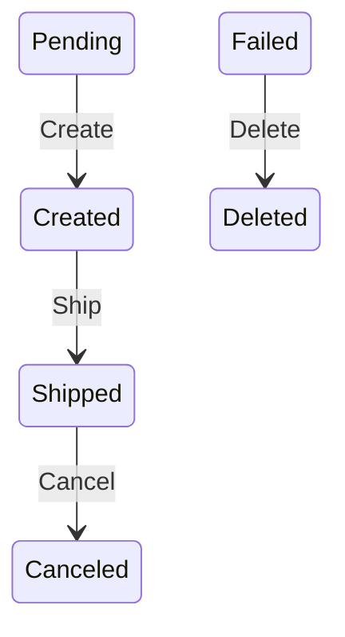

# FlowLite.Diag

FlowLite.Diag is a cross-platform .NET CLI tool for **visualizing finite state machine (FSM)** state transitions based on `FlowTransitionBuilder` code from the [`FlowLite`](https://github.com/HawkN113/FlowLite) library.

## Features
- Scans `.cs` files and locates all `FlowTransitionBuilder<...>` instances.
- Generates **Mermaid.js** or **DOT (Graphviz)** diagrams from C# code.
- Automatically separates transitions by builder instance.
- Displays file path and per-builder FSM diagrams in the output.
---

## Getting Started

### When to Use FlowLite.Diag?
- Designing workflows and business processes using [FlowLite](https://www.nuget.org/packages/FlowLite/)
- Auto-generating documentation from source.
- Visual debugging of state transitions.

### Prerequisites

- .NET 8 or higher.
- Install the library [FlowLite](https://www.nuget.org/packages/FlowLite/) package.
- C# source using `FlowTransitionBuilder` of [FlowLite](https://www.nuget.org/packages/FlowLite/) package.
---

## Installation

To install the latest version of the [FlowLite.Diag](https://www.nuget.org/packages/FlowLite.Diag/) package:

### NuGet Package Manager
**Installation**
```bash
dotnet tool install -g flowlite-diag --add-source ./nupkg
```

**Uninstallation**
```bash
dotnet tool uninstall -g flowlite-diag
```
---

## Usage Guide

---
### Usage command
```bash
flowlite-diag --source "C:\Orders\" --format "mermaid"
```
Argument | Description                                                                      | Example
---------|----------------------------------------------------------------------------------|---------|
--source, -s | Specifies the path to the project directory.                                     | "C:\Orders\"
--format, -f | Specifies the export format of the output. Supported values: `dot` or `mermaid`. | "mermaid"

### Example Diagram (Mermaid)

---

## License
This project is licensed under the MIT License.